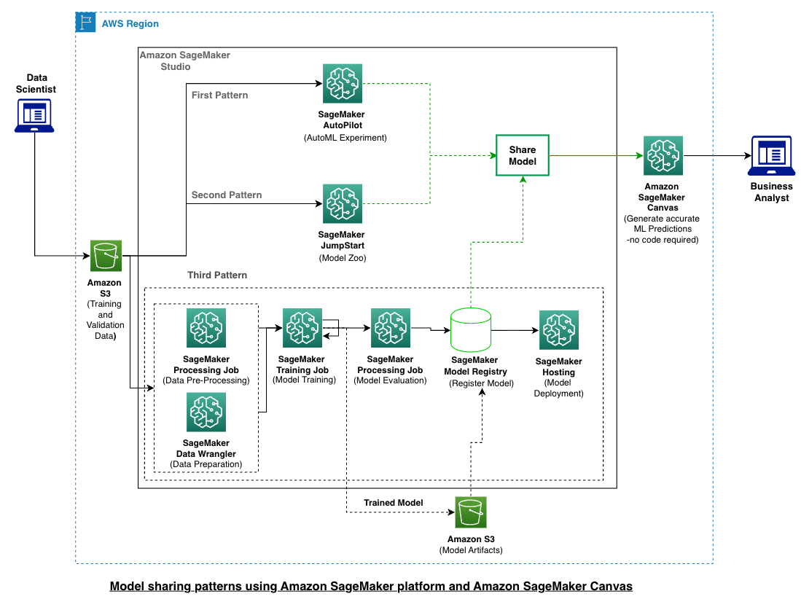

# Machine Learning (ML) Model Sharing Pattern using SageMaker Model Registry and SageMaker Canvas

## Usecase:
Machine Learning (ML) helps organizations generate revenue, reduce costs, mitigate risk, drive efficiencies, and improve quality by optimizing core business functions across multiple business units such as marketing, manufacturing, operations, sales, finance, and customer service. To accelerate ML value creation from months to actually hours, organizations need ML No-code/Low-code tools. Allow data scientists to share ML models with business analyst efficiently with model lineage. Business analyst can apply their domain knowledge, run trails and use ML models without any machine learning experience. 

We showcase architectural patterns on how business teams can leverage ML models built anywhere by generating predictions in SageMaker Canvas and achieve effective business outcomes. This integration of model development and sharing creates a tighter collaboration between business and data science teams and lowers time to value. Learn how business teams can leverage existing models built by their data scientists or other departments to solve a business problem(s), instead of re-building the new models in the outside environments. It might be difficult to use ML models built outside due to considerable manual effort and a code change. Amazon Sagemaker Studio provide model sharing feature with SageMaker Canvas. It helps in uniting the efforts of the data scientist, ML and business teams to fulfill common business objectives. Finally, business analysts can import shared models into Amazon SageMaker Canvas, generate predictions before deploying to production with just a few clicks.

Let’s assume the role of a Data Scientist, you are building an end-to-end ML project which includes data preparation, model training, model hosting, model registry and model sharing with business analyst. Optionally, for data preparation and pre- or post-processing steps, you can use SageMaker Data Wrangler and SageMaker Processing Job. 
Here is the reference architecture, here we are demostrationg third pattern. 
In this example notebook, we are using Abalone dataset available on Kaggle. The target variable is age of Abalone. 

||

## Steps:

### Step_1: 
Login to [Amazon SageMaker Studio](https://docs.aws.amazon.com/sagemaker/latest/dg/studio-launch.html).
### Step_2: 
Clone the [Github repo](https://gitlab.aws.dev/zamsh/sagemaker_model_sharing_using_model_registry_and_canvas.git).
### Step_3: 
Execute the jupyter notebook => sklearn-regression-linear-SDK-V0.1.ipynb
### Step_4: 
Create an S3 bucket <<S3_bucket_name>> in same region as Amazon Sagemaker Studio.
### Step_5: 
Download the [Training and Validation data from Kaggle](https://www.kaggle.com/datasets/asharma237/abalone-dataset-with-header).
### Step_6:
Create a training data path in your S3 bucket and upload the training data file => s3://<<S3_bucket_name>>/dataset/abalone-training-data.csv
### Step_7:
Create a validation or test data path and upload the validation data file => s3://<<S3_bucket_name>>/dataset/abalone-validation-data.csv
### Step_8: 
In studio, Navigate to Models -> Model Registry->under Model group
### Step_9: 
Follow step-by-step instructions, navigate to “Model Registry” section on [How to share a model version from Model Registry to Canvas](https://docs.amazonaws.cn/en_us/sagemaker/latest/dg/canvas-byom.html) Select the model version 1 and click share. 
### Step_10:
Share the model with canvas user (business analyst) by adding a canvas user detail, use S3 uri for training and validation dataset and select the problem type as regression model. Finally share the model using SageMaker Studio from SageMaker Model registry with a Canvas user.
### Step_11:
Login to SageMaker canvas application (using the same canvas user with whom you shared the model in Step_9 and Step_10) and import the model. 
### Step_12:
Use the model and [start making the predictions on your data](https://docs.aws.amazon.com/sagemaker/latest/dg/canvas-getting-started.html#canvas-getting-started-step5).

## License
This library is licensed under the MIT-0 License. See the LICENSE file.
